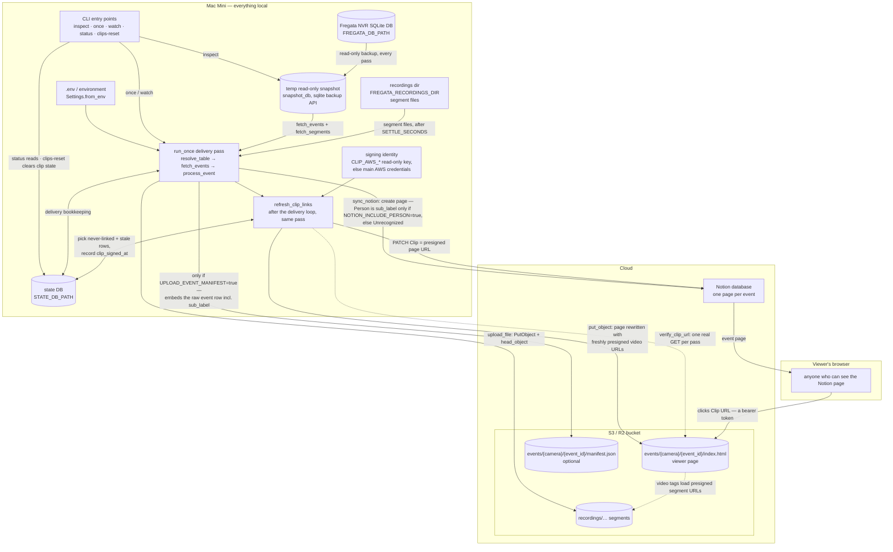
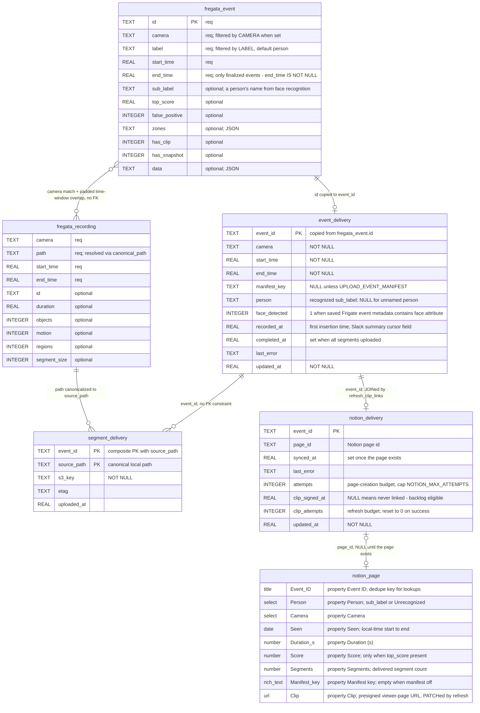

# Architecture

How data moves through `reconciler.py` and what is persisted where. Rules for
*changing* this pipeline (privacy, ordering, fail-safe defaults) live in
[`AGENTS.md`](AGENTS.md) — this file only maps the mechanism. Configuration is
documented variable-by-variable in [`.env.example`](.env.example).

## Data flow

One process, no server. `watch` runs `run_once` every `POLL_SECONDS`; each pass
snapshots the NVR database read-only, uploads any finalized events' footage,
mirrors each event to Notion, and only then refreshes stale presigned clip
links (delivery ordering — see AGENTS.md Invariants). `DRY_RUN=true` (the
default) logs every S3 and Notion write instead of performing it.

- **Where a person's name can travel.** `sub_label` (face recognition) leaves
  the snapshot on exactly two edges, both default-off: into the manifest when
  `UPLOAD_EVENT_MANIFEST=true` (the manifest embeds the whole raw event row),
  and into the Notion `Person` property when `NOTION_INCLUDE_PERSON=true`
  (otherwise every page reads "Unrecognized"). It is never written to the state
  DB, the viewer page, or logs.
- **Presigned URLs are bearer tokens.** The Clip link and the video URLs
  inside the viewer page are SigV4 presigned GETs (TTL `CLIP_URL_TTL_SECONDS`,
  clamped to the 7-day SigV4 ceiling). `refresh_clip_links` re-signs anything
  older than `CLIP_REFRESH_SECONDS`; re-signing never revokes, so the kill
  switch is deactivating the dedicated read-only `CLIP_AWS_*` key. The full
  threat model is the "Know what you are enabling" list in `README.md`.
- **Slack daily summary** (end-of-day digest of unrecognized visitors) exists
  only on the unmerged `slack-daily-summary` branch (PR #8) and is therefore
  not drawn; its fixed contract is in AGENTS.md Invariants.

## Entities

Three stores. The Fregata tables are read-only and *discovered*, not assumed:
`resolve_table` accepts `event`/`events` and `recordings`/`recording`, checking
each candidate has the required columns (marked `req` below; the other listed
columns are selected only when present). The state DB schema is created by
`open_state` in `reconciler.py`, which also `ALTER TABLE`s older state DBs up
to the current shape. The Notion properties must already exist in the target
database (`test-notion.py` verifies them; `notion-database-template.csv` is a
template).

- **No foreign keys anywhere.** Events and recordings are related only by
  `fetch_segments`' query: same `camera`, and the recording's time range
  overlapping the event window padded by `PRE_ROLL_SECONDS` /
  `POST_ROLL_SECONDS`. The three state tables share `event_id` by convention;
  the one SQL JOIN is `notion_delivery ⋈ event_delivery` in the refresh pass
  (which also means clip links survive Fregata's retention evicting the
  source event).
- **The state DB outlives the source.** Everything the refresh pass needs —
  camera, segment `s3_key`s, page id — comes from the state DB, never from
  Fregata.
