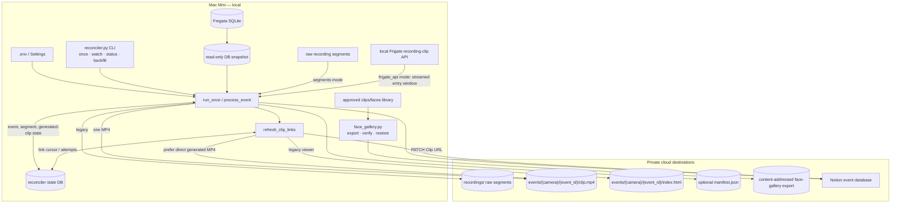
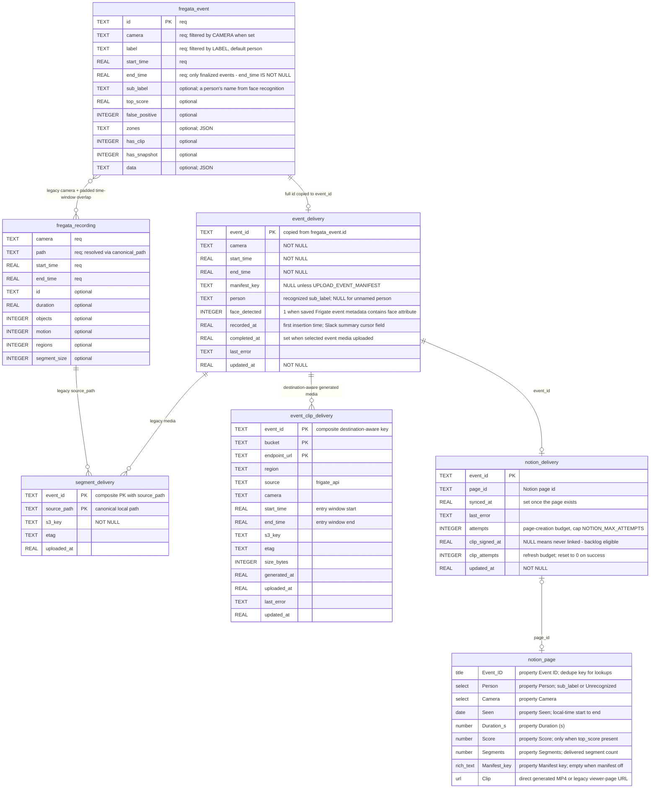

# Architecture

How data moves through `reconciler.py` and what is persisted where. Rules for
*changing* this pipeline (privacy, ordering, fail-safe defaults) live in
[`AGENTS.md`](AGENTS.md) — this file only maps the mechanism. Configuration is
documented variable-by-variable in [`.env.example`](.env.example).

## Data flow

`watch` runs `run_once` every `POLL_SECONDS`; each pass snapshots the NVR
database read-only, delivers finalized person events, mirrors them to Notion,
then refreshes stale presigned links. `DRY_RUN=true` remains the safe default.

Event media has two explicit modes:

- `CLIP_SOURCE=segments` uploads every overlapping raw recording segment and
  builds the legacy multi-video HTML page.
- `CLIP_SOURCE=frigate_api` streams one short MP4 centered on the exact
  Frigate `event.id` start, uploads it, and links that object directly.

The independent `face_gallery.py` CLI exports approved face-library images; it
does not participate in the live reconciliation loop.

- **Identity association is event-based.** `person` and `face_detected` are
  copied from the same Frigate event and keyed by its full `event.id`.
  Timestamps select reporting or clip windows; they do not join a separate face
  to the nearest event.
- **Privacy defaults remain outbound-safe.** The local state DB stores the
  recognized `sub_label` so summaries can classify events, but a name reaches
  Notion only with `NOTION_INCLUDE_PERSON=true` and reaches a manifest only with
  `UPLOAD_EVENT_MANIFEST=true`. Both default off.
- **Presigned URLs are bearer tokens.** They are SigV4 GETs capped at seven
  days, and temporary SSO/STS credentials shorten their real life. Generated
  clips are linked directly; legacy mode signs an HTML page plus its segments.
- **Approved face exports are isolated.** S3 keys are content-addressed and do
  not include names. Names remain inside the private encrypted-at-rest export;
  `train`, symlinks, hidden content, and unsupported files are excluded.
- **Slack summaries are current functionality.** Unknown summaries can require
  the same event's face attribute with `SLACK_UNKNOWN_REQUIRES_FACE=true`;
  this filter affects Slack, not event delivery.

## Entities

The Fregata tables are read-only and *discovered*, not assumed:
`resolve_table` accepts `event`/`events` and `recordings`/`recording`, checking
each candidate has the required columns (marked `req` below; the other listed
columns are selected only when present). `open_state` creates and migrates the
local delivery schema. Notion properties must already exist in the target
database (`test-notion.py` verifies them).

- **No foreign keys anywhere.** Legacy raw segments are selected by camera and
  padded overlap. Generated clips use the exact event ID plus a short
  start-anchored API window. State tables share `event_id` by convention.
- **The state DB outlives the source.** Refresh uses the saved camera, generated
  clip or segment keys, and Notion page ID. Historical generation still depends
  on Frigate retaining the underlying recording range.
