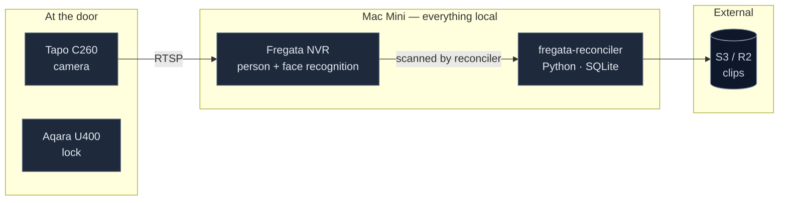

# fregata-reconciler

Event-driven ingestion service. Reconciles Fregata events and recording segments directly to S3.

## Architecture

Everything that touches footage runs on the Mac Mini. Only derived artifacts — clips and recording segments — leave the house.



## Setup

```bash
python3 -m venv venv
source venv/bin/activate
pip install -r requirements.txt
cp .env.example .env      # fill in credentials
```

Requires Python 3.12+.

### Autostart

```bash
cp launchd/com.swarm.entry-logger.plist ~/Library/LaunchAgents/
launchctl load ~/Library/LaunchAgents/com.swarm.entry-logger.plist
```

Edit the paths in the `.plist` file first. LaunchAgents need a logged-in session, so **enable auto-login on the Mac Mini** or nothing restarts after a power cut.

## Usage

The reconciler takes one of the following commands:

- `inspect`: Inspects the source Fregata database and outputs table/column information.
- `once`: Runs a single reconciliation pass over the Fregata database.
- `watch`: Runs `once` in an infinite loop, sleeping for `POLL_SECONDS` between passes.
- `status`: Outputs the current delivery status, including completed/failed events and uploaded segments.
- `slack-summary`: Posts the Slack unknown-visitor summary immediately, ignoring the schedule (with `DRY_RUN=true` it prints the message instead of posting).
- `event-clips-backfill`: Dry-run or generate missing single entry-focused MP4s for a historical date.

Example:

```bash
python3 reconciler.py watch
```

## Approved face-library backup and migration

`face_gallery.py` backs up only reviewed images inside visible person directories
under Frigate's `clips/faces` library. It excludes `train`, hidden entries,
symlinks, unsupported files, and loose files outside a person directory. Raw
approved images are the canonical migration data; face-model embeddings are
rebuildable. `FACE_GALLERY_BFR_DB` can add a consistent `bfr.db` snapshot for
convenience, but it does not replace the raw images.

Build locally and print the deterministic export ID without contacting S3:

```bash
python3 face_gallery.py export
```

Publish the archive and versioned manifest, verify their SHA-256 hashes through
S3 `head` and `get` operations, then publish `COMPLETE` last:

```bash
python3 face_gallery.py export --apply
python3 face_gallery.py verify EXPORT_ID
```

Restore always verifies the completed remote export first. Without `--apply` it
is a no-write preview; with `--apply` it extracts only into the requested empty
staging directory:

```bash
python3 face_gallery.py restore EXPORT_ID --output ~/face-gallery-staging
python3 face_gallery.py restore EXPORT_ID --output ~/face-gallery-staging --apply
```

Restore rejects traversal paths, symlink members, populated output directories,
and any output that overlaps the configured live face library. It never writes
to Frigate directly: inspect the staging directory, then import it separately.

Treat the destination as a private biometric-data backup. S3 object keys are
content-addressed and contain no person names, and routine logs report only IDs
and counts; names remain inside the encrypted archive and manifest. Every object
uses SSE-S3 (`AES256`) by default. Set `FACE_GALLERY_KMS_KEY_ID` to require
SSE-KMS instead. See `.env.example` for bucket/profile/source configuration and
the optional database snapshot.

## Clip links in Notion (optional)

With `CLIP_LINKS=true`, every Notion page gets a working video link in its **Clip**
property (create it in the database first, type **URL** — `python3 test-notion.py`
verifies it). `CLIP_SOURCE=segments` preserves the legacy viewer page with one
player per raw Frigate recording segment. `CLIP_SOURCE=frigate_api` instead asks
the local Frigate API for one short MP4 centered on the person event's start and
links that object directly. This avoids showing sound/motion-retained boundary
segments where the person is absent. It does not remove an audio track that is
inside the event clip.

The poll loop re-signs links older than `CLIP_REFRESH_SECONDS`; signatures die at
`CLIP_URL_TTL_SECONDS` and SigV4 caps them at seven days. Existing legacy pages
remain usable while single-event clips are backfilled.

Know what you are enabling:

- **The link is a bearer token.** Anyone who can see the Notion page — including via
  a share link or a forwarded URL — can watch that event until the signature expires.
  Keep the database's publish-to-web off. Notion's page history also retains
  superseded links until they expire on their own. In legacy `segments` mode,
  each refresh rewrites the viewer page in place with fresh video URLs, so someone
  who captured a page link and re-fetches it near expiry can reach the videos for
  up to `CLIP_URL_TTL_SECONDS + CLIP_REFRESH_SECONDS` after capture. Generated
  direct-MP4 links do not have that extra viewer-page renewal behavior.
- **Re-signing does not revoke.** Old URLs stay valid to their own expiry. The kill
  switch is deactivating the signing key — set `CLIP_AWS_ACCESS_KEY_ID`/`_SECRET` to
  a dedicated read-only IAM user so that gesture doesn't stop uploads too.
- **Long-term IAM user keys only.** Session credentials (SSO/STS) silently cap the
  signature's life at the session's, and the reconciler can only warn about it.
- **`AWS_REGION` must match the bucket's region.** Uploads survive a mismatch
  (botocore silently redirects) but presigned URLs do not — they fail only at click
  time. The reconciler click-checks one freshly signed link per pass and surfaces a
  failure as a `CLIP FAILED` line in `status`.
- The dedicated signer needs only `GetObject` on the prefix — nothing else. The
  viewer page itself is uploaded by the main credentials, whose policy already has
  `PutObject`.
- If an S3 lifecycle rule expires old segments, the pages for those events keep
  rendering but their videos 404. The link makes existing retention visible.
- **No silent source fallback.** Once `CLIP_SOURCE=frigate_api` is enabled, an
  API failure is recorded and retried; it never quietly returns to multi-segment
  HTML while claiming success.

After fixing a broken setup (Clip property was missing, or the signing key was
rotated), run `python3 reconciler.py clips-reset` to re-sign everything.

Prove the configured local API first, then enable new single-event clips:

```bash
curl -fL \
  \"http://127.0.0.1:5000/api/door_camera/start/START/end/END/clip.mp4\" \
  -o /tmp/frigate-event-test.mp4

# after inspecting the MP4:
# CLIP_SOURCE=frigate_api
python3 reconciler.py once
```

Historical backfill is safe by default and requires `--apply` to write:

```bash
python3 reconciler.py event-clips-backfill --date 2026-08-29 --dry-run
python3 reconciler.py event-clips-backfill --date 2026-08-29 --apply
```

Each success stores
`fregata/events/<camera>/<event_id>/clip.mp4`, verifies its S3 length, and marks
that Notion link stale for the normal refresh pass. A missing historical Frigate
recording keeps its legacy HTML link.

## Slack end-of-day summary (optional)

With `SLACK_WEBHOOK_URL` set, the watch loop posts **one message per day** at
`SLACK_SUMMARY_TIME` (local, default 21:00) listing unnamed person events since
the previous summary. There are no per-event pings — the door camera should not
own your notifications — and quiet days post nothing unless
`SLACK_SUMMARY_ON_EMPTY=true`.

Design choices worth knowing:
- **Slack Block Kit Cards.** Summaries are formatted as Slack Block Kit cards
  with table-like event rows: snapshot thumbnail when enabled, time, duration,
  camera/status, and a direct Notion page link.
- **Snapshots are opt-in.** Set `SLACK_INCLUDE_SNAPSHOTS=true` to upload event
  snapshots from Frigate's `media/clips` directory to S3 and include presigned
  image URLs in Slack. Leave it off if you do not want face images retained by
  Slack.
- **Recognized visitors opt-in.** Familiar (household) people can be included
  in the summary by setting `SLACK_INCLUDE_KNOWN=true`. Recognized names and
  visit counts are listed cleanly without attaching video links.
- **Back-facing exits can be filtered.** Set
  `SLACK_UNKNOWN_REQUIRES_FACE=true` to include an unnamed person only when
  Frigate's saved event metadata contains a detected `face` attribute. This
  suppresses typical back-of-head exits but can omit a real unknown entrant
  whose face was never visible. It changes Slack only; footage still reaches
  S3 and Notion.
- **No presigned clip URLs in Slack.** Video links remain out of Slack; each
  event card links to its Notion page instead, which is access-controlled and
  where the clip already lives.
- **Windows are gap-free, not calendar days.** Each summary covers everything
  recorded since the previous one, so an event at 23:50 lands in the next evening's
  message rather than vanishing. If the Mac is asleep at summary time, the first
  pass after it wakes posts one combined catch-up message.
- **Enabling it does not dump history.** The first pass after configuring the
  webhook only opens the window; the first real summary arrives the next scheduled
  time.
- A failed post (Slack down, webhook revoked) retries on the next poll without
  losing the window. `status` reports the last summary time as
  `slack_last_summary`.

Test the pipe end-to-end with `python3 reconciler.py slack-summary`, which posts
immediately (covering the last 24 h if no summary was ever sent).

To send a summary for a **specific historical date** (without modifying the automated schedule cursor):

```bash
python3 reconciler.py slack-summary 2026-08-19
# or with flag:
python3 reconciler.py slack-summary --date 2026-08-19
```

The scheduled message is unknown-only unless `SLACK_INCLUDE_KNOWN=true`. To send
a separate familiar-people summary for a local calendar day, without changing
the scheduled cursor, use the plain numbered-name list:

```bash
python3 reconciler.py slack-people-summary 2026-08-19
# or omit the date for today's local calendar day:
python3 reconciler.py slack-people-summary
```

## Dependency register

Everything the service needs, declared. Nothing here should live only in someone's shell history.

| Dependency | Where declared | Fails how |
|---|---|---|
| Fregata DB accessible | `FREGATA_DB_PATH` | Poll fails, cursor holds |
| S3 credentials | `.env` | Upload retries with backoff |
| Slack webhook valid | `SLACK_WEBHOOK_URL` | Summary retries next poll; deliveries unaffected |
| Auto-login enabled | macOS setting | **Nothing restarts after power loss** |
